# Индексы и оптимизация запросов:

## При выполнении работы было реализовано: 

- генератор пользователей на Го [тут](../../cmd/users-generator), который делает insert в базу батчом по 1000шт
- сгенерировано 5828459 анкет пользователей
- добавлена ручка /search из спецификации

## Графики:

###  10 rps

##### latency до индекса
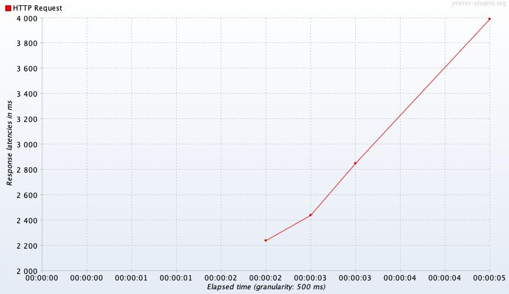
##### throughput до индекса
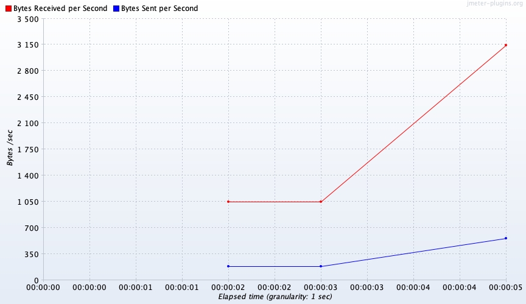
##### http codes до индекса
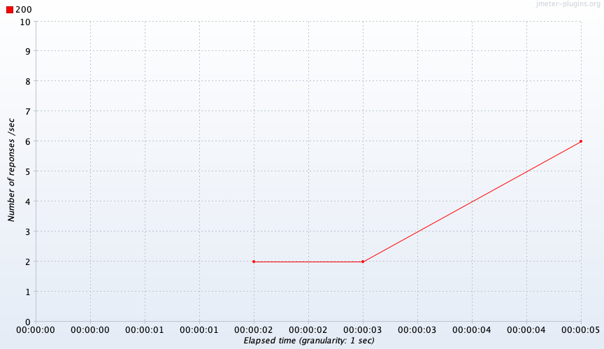
##### latency после индекса
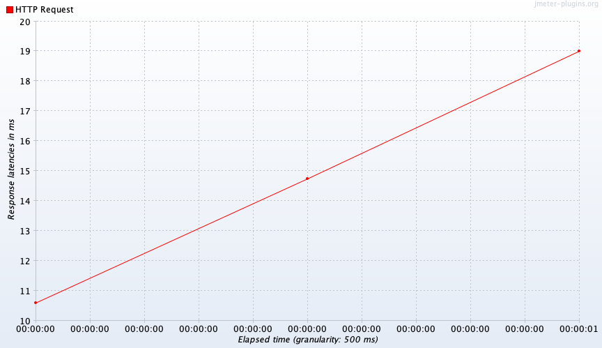
##### throughput после индекса
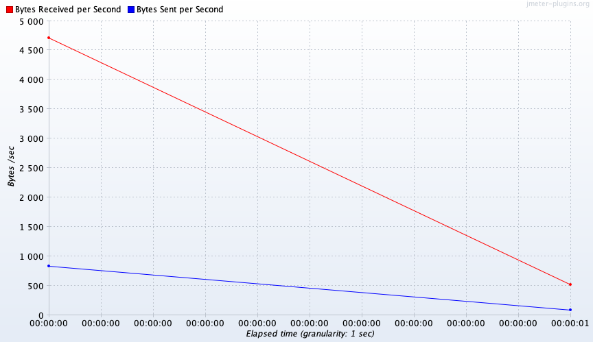
##### http codes после индекса
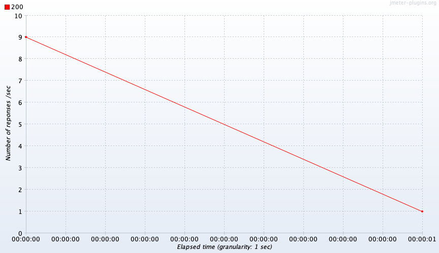

###  100 rps

##### latency до индекса
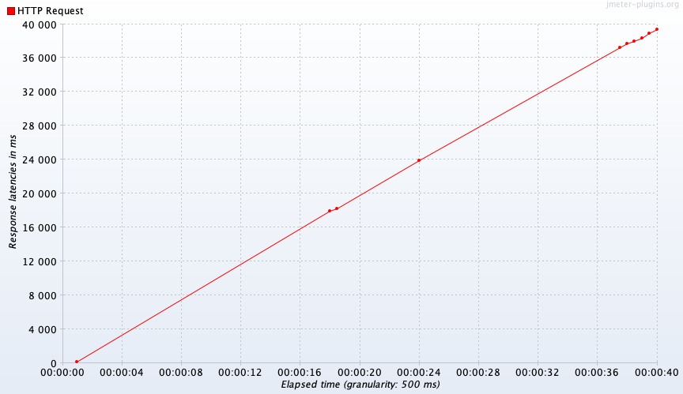
##### throughput до индекса
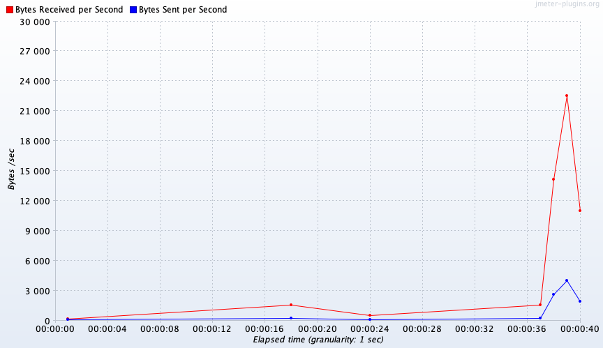
##### http codes до индекса
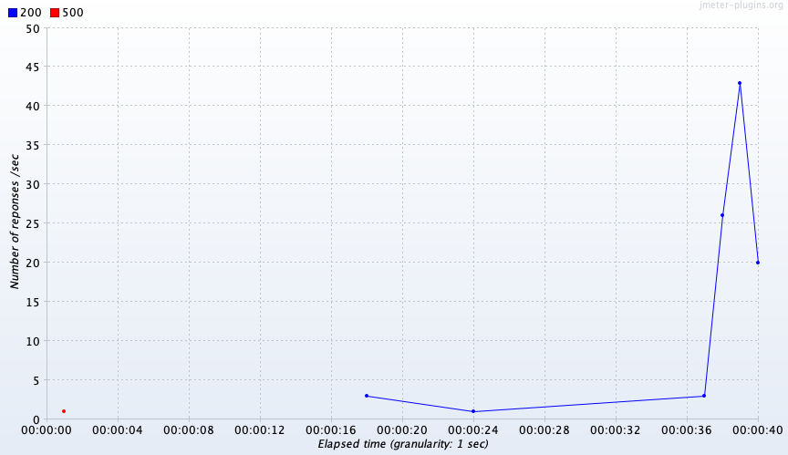
##### latency после индекса
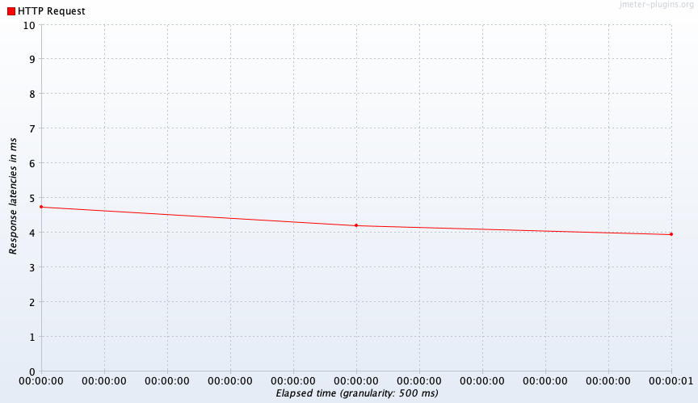
##### throughput после индекса
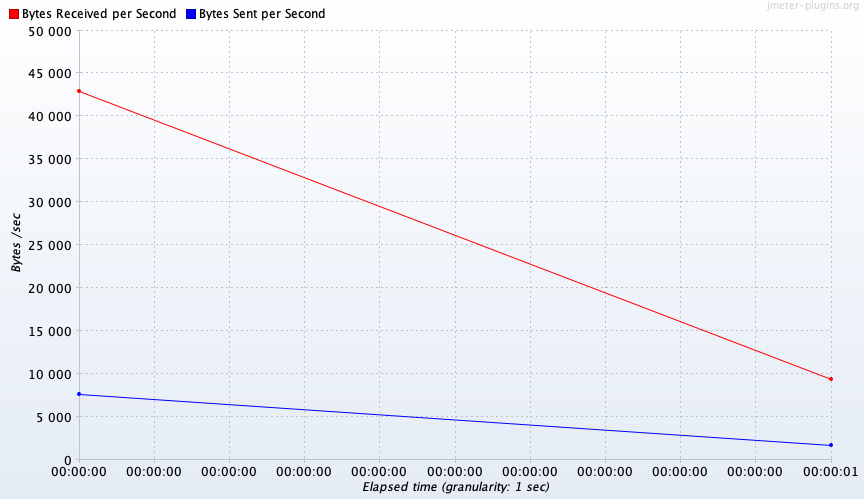
##### http codes после индекса
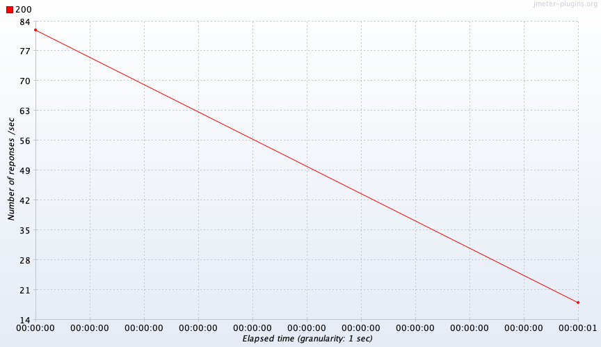

###  1000 rps

##### latency до индекса
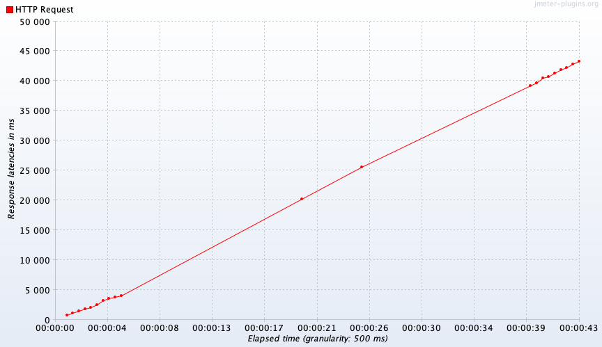
##### throughput до индекса
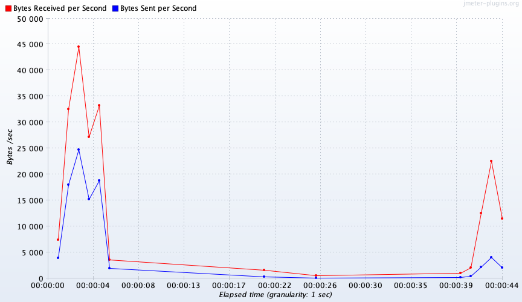
##### http codes до индекса
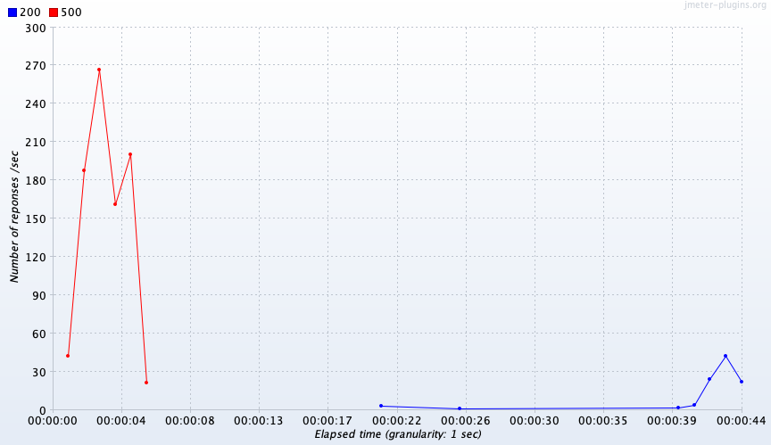
##### latency после индекса
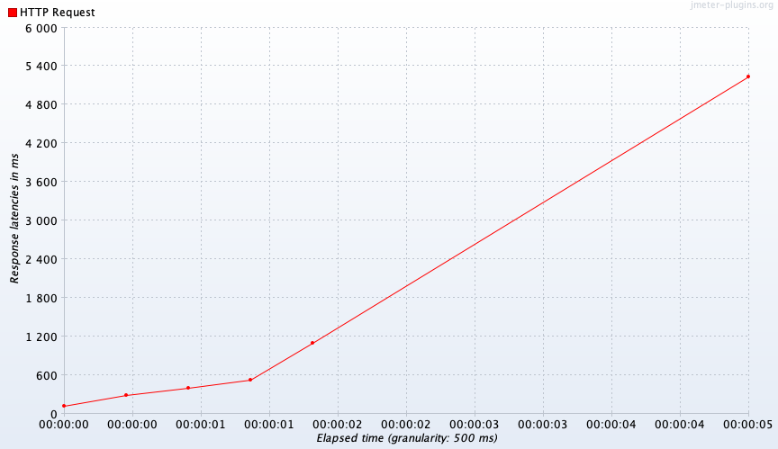
##### throughput после индекса
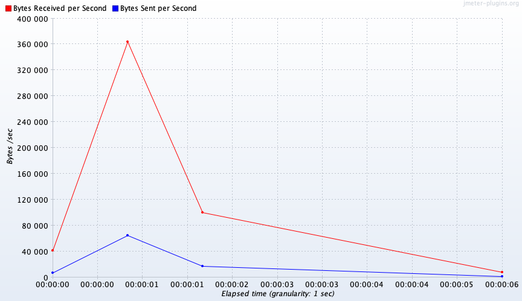
##### http codes после индекса
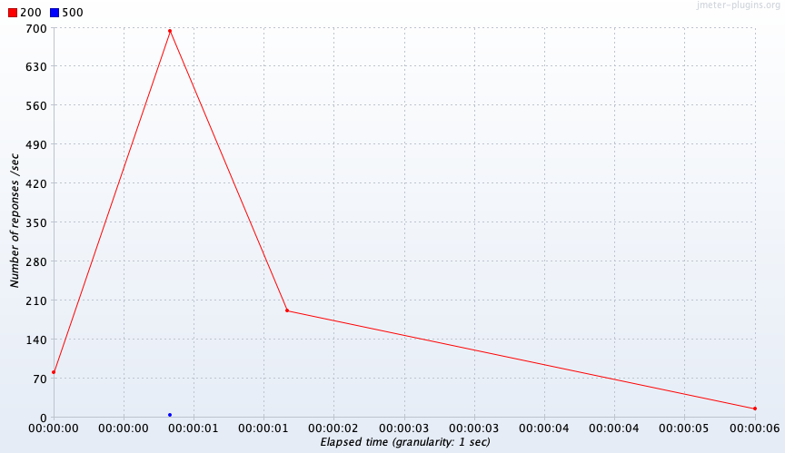

###  10000 rps

##### без индекса - приложение может выдержать больше, но умирает база, не выдерживает такое количество коннектов.
##### А вот с индексом все работает замечательно. Добавление 1го доп пода приложения решит проблему небольшого фона пятисоток.

##### latency после индекса
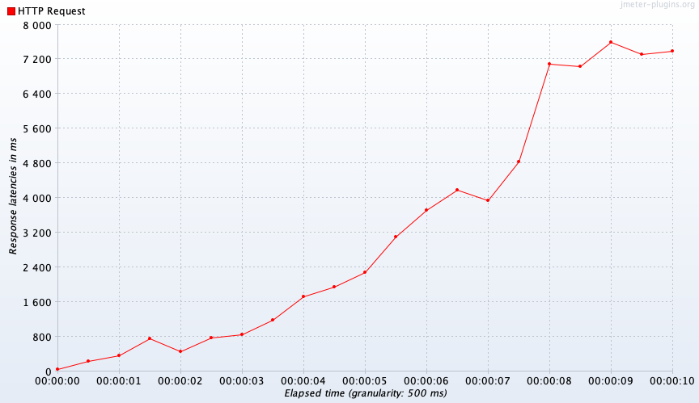
##### throughput после индекса
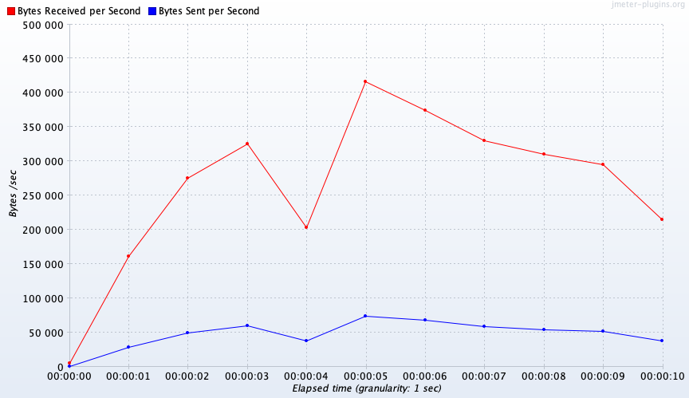
##### http codes после индекса
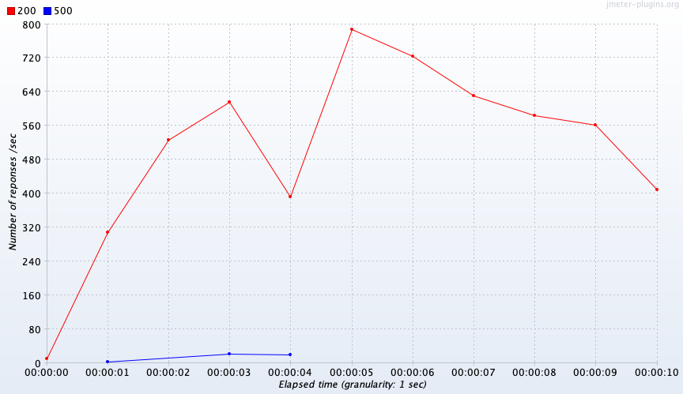


## По пунктам:
- запрос добавления индекса
    ```sql
    CREATE EXTENSION IF NOT EXISTS pg_trgm;
    CREATE EXTENSION IF NOT EXISTS btree_gin;
    CREATE INDEX user_first_name_idx ON user_table USING gin (first_name gin_trgm_ops);
    CREATE INDEX user_second_name_idx ON user_table USING gin (second_name gin_trgm_ops);
    ```

- explain запросов до индекса
```
Gather  (cost=1000.00..173972.07 rows=2 width=146)
  Workers Planned: 2
  ->  Parallel Seq Scan on user_table  (cost=0.00..172971.87 rows=1 width=146)
        Filter: ((deleted_at IS NULL) AND (first_name ~~* 'na%'::text) AND (second_name ~~* 'na%'::text))
JIT:
  Functions: 4
"  Options: Inlining false, Optimization false, Expressions true, Deforming true"
```

- explain запросов после индекса
```
Bitmap Heap Scan on user_table  (cost=410.54..418.55 rows=2 width=146)
  Recheck Cond: ((first_name ~~* 'na%'::text) AND (second_name ~~* 'na%'::text))
  Filter: (deleted_at IS NULL)
  ->  BitmapAnd  (cost=410.54..410.54 rows=2 width=0)
        ->  Bitmap Index Scan on user_first_name_idx  (cost=0.00..68.62 rows=352 width=0)
              Index Cond: (first_name ~~* 'na%'::text)
        ->  Bitmap Index Scan on user_second_name_idx  (cost=0.00..341.67 rows=36040 width=0)
              Index Cond: (second_name ~~* 'na%'::text)
```

- использовал модуль pg_trgm так как он позволяет находить похожие строки, даже если они не совпадают буквенно. Это полезно, например, при исправлении опечаток или при поиске синонимов.
- Трехграммы (pg_trgm) учитывают порядок символов и поддерживают операторы для сравнения, что делает их мощным инструментом для полнотекстового поиска.
- Выбирал индекс из двух: GIN или GIST. Остановился на GIN так как он выполняет поиск по индексу примерно в 3 раза быстрее чем GIST.
- Даже несмотря на то, что пересчет индекса GIN наиболее ресурсозатратная операция, был выбран именно он, так как добавление и регистрация новых пользователей происходит на порядок реже чем чтение информации о них.
- Добавление индекса на отдельные колонки позволяет гибко искать пользователя по имени и фамилии.